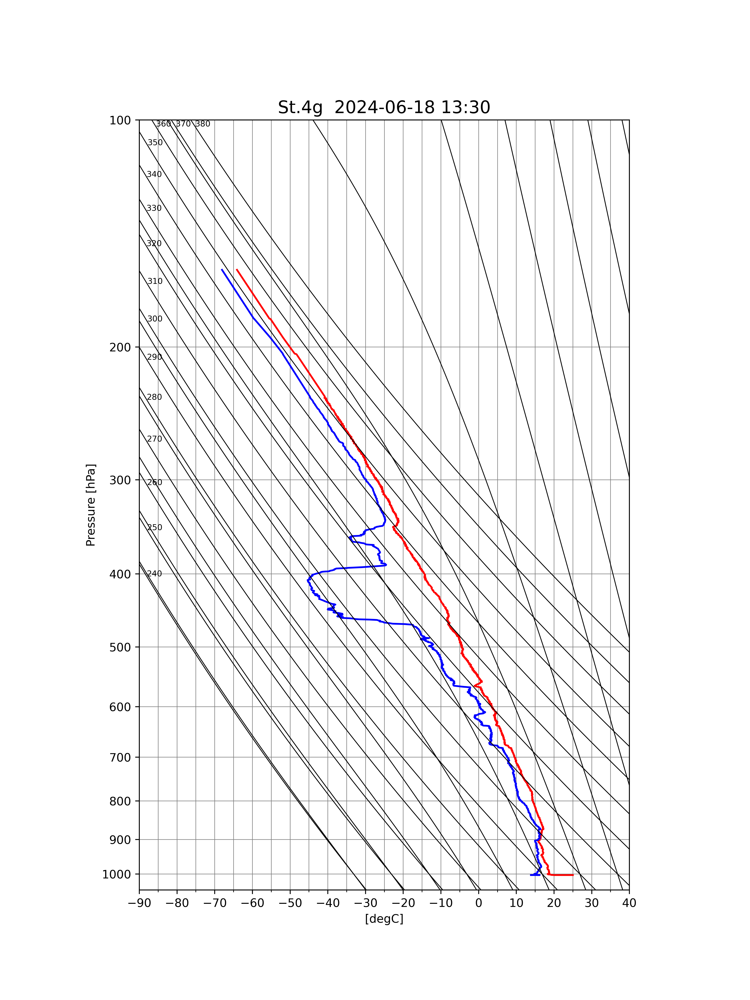

# BSoD
BSoD(BalloonScope on Deck) is a package in Python for reading, visualizing radiosonde data.  
This module was developed for Seisui-maru 2407 cruise.

<p align="center">

</p>

## Dependencies
Required packages:
- Numpy
- Pandas
- Matplotlib
- Cartopy
- MetPy

## Usage
### preprocess
1. Prepare field_book.csv
2. Run ```bsod.util.get_qcdata()```  

(See also ```sample/script/preprocess.py```)
### visualization
- emagram: ```bsod.plots.emagram()```
## Author
Sou Tomita

