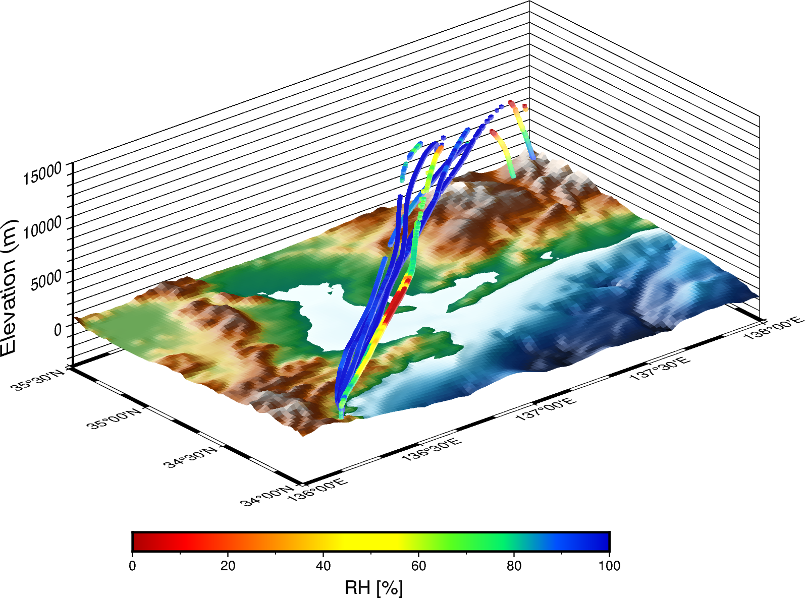

# BSoD
BSoD(BalloonScope on Deck) is a package in Python for reading and visualizing radiosonde data.  
This module was developed for Seisui-maru 2407 cruise.

<p align="center">



</p>

## Dependencies
Required packages:

- Numpy
- Pandas
- Matplotlib
- Cartopy
- MetPy
- PyGMT

For run ```plot_3d_trajectory_animation.csh```, the following are required
- tqdm
- convert (in ImageMagick)

## Usage
### preprocess
1. Prepare field_book.csv
2. Run ```bsod.util.get_qcdata()```  

(See also ```sample/script/preprocess.py```)
### visualization
- emagram: ```bsod.plots.emagram()```

## Sample
### radiosonde data ```sample/data/raw_data```
Sample data was observed on Seisui-maru 2407 cruise  
(2024年度　三重大学　陸海空・環境科学実習).  
### field book ```sample/data/field_book.csv```


## Author
Sou Tomita

