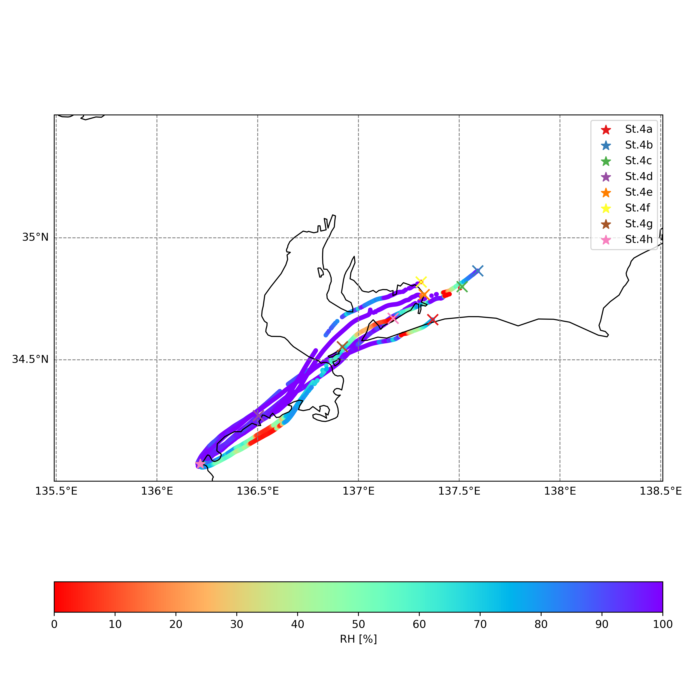

# BSoD
<p>


</p>
BSoD(BalloonScope on Deck) is a package in Python for reading and visualizing radiosonde data.  
This module was developed for Seisui-maru 2407 cruise.

<p align="center">

<br>

</p>

## Dependencies
Required packages (tested versions):
- Python (3.13.3)
- Numpy (2.2.5)
- Pandas (2.2.3)
- Matplotlib (3.10.1)
- Cartopy (0.24.0)
- MetPy (1.7.0)
- PyGMT (0.15.0)

To run ```plot_3d_trajectory_animation.csh```, the following are required
- tqdm (4.67.1)
- ImageMagick  (7.1.1-47)
  
(example: Anaconda env.)
```
conda install -c conda-forge numpy pandas matplotlib cartopy metpy pygmt tqdm imagemagick
```   
## Usage
### preprocess
1. Prepare ```field_book.csv```  
example:
```
st_name,JSTtime,sonde_no
St.4a,2024-06-18_06:01,1101771
```
2. Quality control.   ```bsod.util.get_qcdata()```  

(See also ```sample/script/preprocess.py```)
### visualization
- emagram: ```bsod.plots.emagram()```
- 2D trajectory: ```bsod.plots.plots_trajectory2d```
- 3D trajectory: ```bsod.plots.plots_trajectory3d```  
(See also ```sample/script/figures.py```)

## Sample
### radiosonde data  
```sample/data/raw_data```  
Sample data was observed in Seisui-maru 2407 cruise  
(2024年度　三重大学　陸海空・環境科学実習).  
### field book 
```sample/data/field_book.csv```   
### script
- ```sample/scrpit/libcheck.py```  
check the dependencies.
- ```sample/script/preprocess.py```  
conduct quality Control
- ```sample/script/figures.py```  
plot emagram and 2D/3D trajectory
- ```sample/script/plot_3d_trajectory_animation_new.csh```  
plot animation of the 3D trajectories.(C shell, IMv7)
- ```sample/script/plot_3d_trajectory_animation_old.csh```  
same as above.(C shell, IMv6)   
- ```sample/script/plot_3d_trajectory_animation_new.py```   
same as above.(Python,IMv7)   
- ```sample/script/plot_3d_trajectory_animation_old.py```  
same as above.(Python,IMv6)   


## Author
Sou Tomita

